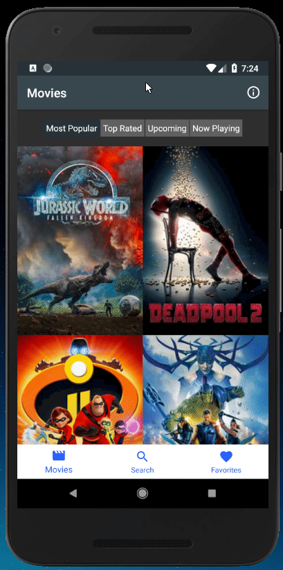
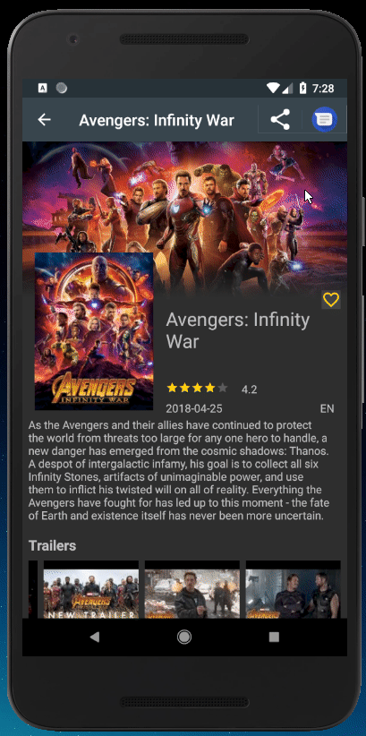
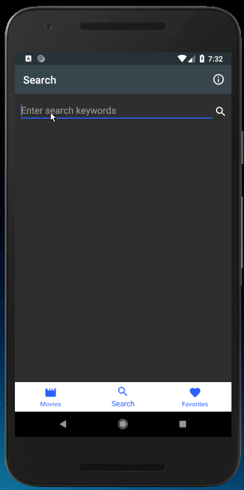
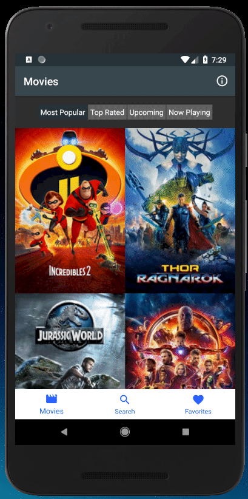
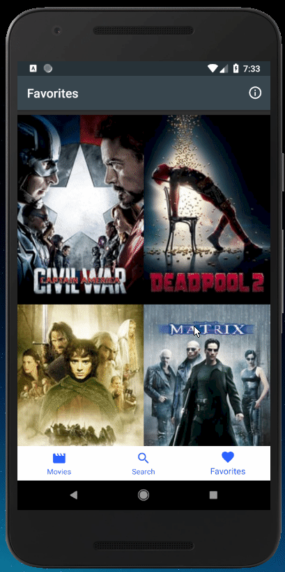
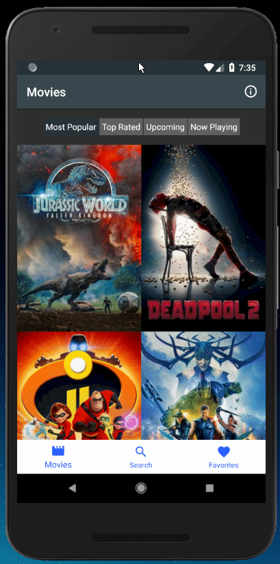

# Popular Movies - Phase2
Code for Udacity Android Developer Nanodegree Project 2 - Popular Movies, Phase 2

**New in Phase 2**
1. Show trailers on movie details activity
2. Show reviews on movie details activity
3. Implement *SQLiteDatabase* and *ContentProvider*, or *Architecture Components*
4. Provide offline "Favorites" functionality
5. Network state change listener
6. Share movie information from Details activity

This app uses TMDB API (https://www.themoviedb.org/documentation/api) to get movie lists, images and information. Please get an API key to use this app and define it in your gradle build system.

*Use following tutorial at medium if you are unfamiliar with defining your API key in gradle : https://medium.com/code-better/hiding-api-keys-from-your-android-repository-b23f5598b906*

* Placeholder images from [freekpik](https://www.freepik.com)
* Icons from [Material Design](https://material.io/)

###Libraries used
1. Retrofit
2. Picasso
3. Data Binding
4. Room with LiveData

####Known issues
1. RecyclerView and ScrollView do not preserve scroll state on rotation

####Work In Progress
1. Add favorite functionality in Main Activity's RecyclerView

####Screenshots

View lists of movies

View movie details

Share movie details

Search for movies

Mark or unmark a movie as favorite 

View Favorites list and unfavorite a movie

Network connectivity

